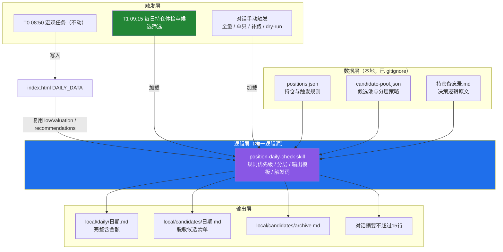
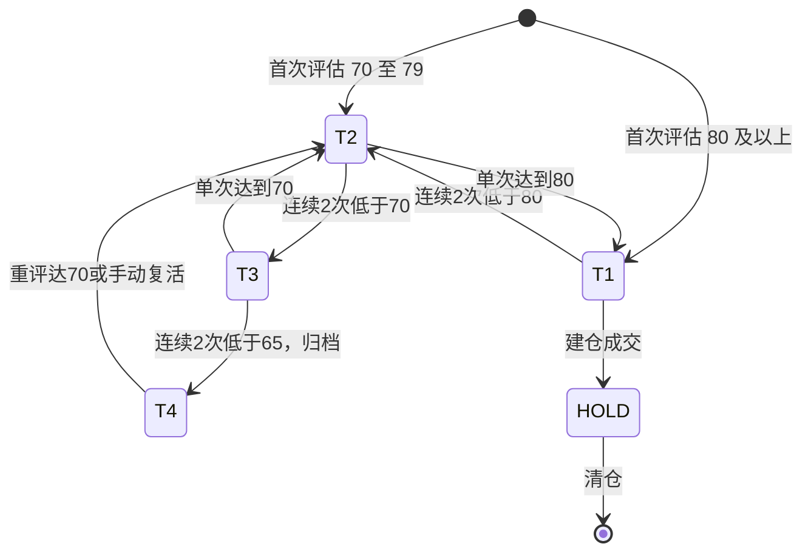

# 每日持仓体检与候选筛选 · 流程与维护说明

> 本文档说明「每日持仓体检 + 候选筛选」这条流水线的架构、时点选择、触发方式、分层参数与维护方法。
> 面向日常维护使用；业务规则本身写在 skill 里，不以本文档为准，本文档只负责"讲清楚怎么用、怎么调、为什么这么设计"。

---

## 1. 这套流水线解决什么问题

在原有的「每日宏观采集（T0）」之上，补上一条"看自己"的流水线：

| 原有能力 | 缺口 | 本流水线补齐 |
|----------|------|--------------|
| 宏观/资金/情绪/行业估值全市场采集 | 不知道这些数据对自己持仓意味着什么 | 逐只持仓比对预设规则，命中才给操作建议 |
| 个股评估（手动） | 池子里 20~30 家全列会淹没重点 | 按分数自动分四档，每日只重点看 8~11 家 |

设计出发点只有一句话：**沉默即正常**。没有规则被命中时只输出一行"无动作"，把注意力留给真正需要决策的那一天。

---

## 2. 三层架构



**核心决策：单一逻辑源（Single Source of Truth）**

业务规则全部收敛在 `position-daily-check` skill 中。定时任务的 prompt 只写"加载该 skill 并执行完整流程"，**不重复任何业务规则**。这样：

- 手动触发与定时触发走同一套规则，不会出现两条路径输出漂移；
- 调整规则只需改 skill 一处，全局生效；
- 定时任务 prompt 保持极简，减少因 prompt 与 skill 不一致导致的隐性 bug。

---

## 3. 角色与时点

| 角色 | 平台标识 | 时点 | 写入范围 | git 操作 |
|------|----------|------|----------|----------|
| T0 每日宏观板块趋势更新 | `automation-2` | 每天 08:50 | `index.html`、`data/reports.json` | **有**（commit & push） |
| T1 每日持仓体检与候选筛选 | `automation-3` | 每天 09:15 | `local/daily/`、`local/candidates/` | **无** |
| 周度宽指配置更新 | `automation` | 每周日 09:30 | `local/broad-index/` | **无** |
| 个股资源池维护（手动） | `stock-pool-maintenance` skill | 用户点名 | `positions.json`、`candidate-pool.json`、备忘录 | 状态跃迁时提交网页文件 |
| 持仓体检（手动） | `position-daily-check` skill | 随时 | 同 T1 | **无** |

### 为什么 T1 定在 09:15

09:15 这个时点，全球主要市场的状态是：

| 市场 | 状态 | 含义 |
|------|------|------|
| 美股 | 已收盘（前一日） | 隔夜行情完整，浮盈亏可算 |
| 韩股 | 已开盘（09:00 开盘） | SK海力士等可拿到当日早盘价 |
| A股 | 未开盘（09:30 开盘） | 建议可在开盘前执行 |
| 港股 | 未开盘（09:30 开盘） | 同上 |

即：**信息足够新，建议仍可执行**，且与 08:50 的 T0 错开 25 分钟，避免同日两个 Agent 会话撞车。

### ⚠️ 已知风险：T0 超时导致重叠

2026-09-11 观察到 T0（`automation-2`）连续两次 **Run timed out**，单次耗时约 **90 分钟**。若 T0 运行超过 25 分钟，会与 09:15 的 T1 重叠。处理建议（按优先级）：

1. **首选**：排查 T0 超时原因（数据源过多 / 单次采集过重），使其稳定在 25 分钟内完成；
2. **次选**：把 T1 后移到 10:30（`FREQ=DAILY;BYHOUR=10;BYMINUTE=30`），代价是 A股已开盘 1 小时，建议从"盘前"变为"盘中可执行"；
3. **兜底**：T1 的 Step 0 已具备 `index.html` 的 `date` 校验，即使读到的是前一日数据，也会在报告第六节标注「宏观口径为 X 日」，**不会静默出错**。

> 修改 T1 时间：`automation_update(mode="suggested update", id="automation-3", ..., rrule="FREQ=DAILY;BYHOUR=9;BYMINUTE=15")`。修改配置的完整说明见 `stock-kb-automation` skill。

---

## 4. 手动触发词表

用户在任何时候用自然语言触发，与定时任务使用**完全相同的逻辑与输出**：

| 模式 | 触发词示例 | 行为 |
|------|-----------|------|
| **全量**（默认） | 跑一次持仓体检、今日持仓检查、每日复盘 | 持仓体检 + 候选筛选 |
| **仅体检** | 持仓体检、只看持仓、我的持仓怎么样、持仓操作建议、要不要加仓/减仓、该不该卖出 | 跳过候选筛选 |
| **仅筛选** | 今日选股、筛一下候选、候选池有什么变化 | 跳过持仓体检 |
| **补跑** | 补跑 9/10 的持仓体检、补跑 2026-09-10 | 用指定日期口径，写入该日期文件，报告头标注「补跑模式」 |
| **单只** | 体检一下 Google、重点看下 SK海力士 | 只跑该只，但走完整 P0–P5 规则链 |
| **干跑** | 试跑持仓体检、只输出不要写文件 | 只输出到对话，不落盘 |
| **看分层** | 看一下候选池分层、候选池现状 | 输出四档清单与升降档变动 |
| **调参** | 候选 Top3 就行、今天不看边缘观察、隐藏 T2 | 参数覆盖（叠加在上述模式之上） |

无参数时默认 = **全量模式**，日期 = 今天。模式判定优先级见 `.codebuddy/skills/position-daily-check/references/rule-engine.md` 第一章。

---

## 5. 规则比对优先级（P0 – P5）


| 优先级 | 规则类型 | 触发后动作 | 说明 |
|--------|----------|-----------|------|
| **P0** | 组合风控线 | 建议减仓 | 主动仓 > 20%、单只 > 5%、组合回撤 < −12%。**硬约束，压过一切**；命中时所有加仓类建议一律抑制 |
| **P1** | 失效条件 | 建议减仓/清仓 | 买入逻辑被破坏，不必等价格；依据必须是可验证事实 |
| **P2** | 止盈/减仓线 | 按比例减仓 | 以收盘价为准；已标注"已触发"的不重复推送 |
| **P3** | 加仓触发 | 建议加仓 | **价格区间 AND 事件条件双确认**，且前置校验 P1 全部未触发；仅触上沿时先执行一半 |
| **P4** | 观察池建仓触发 | 建议先正式评估 | 不直接给建仓指令（标的尚未做完整 8 步研究） |
| **P5** | 无动作 | 输出一行 | 沉默即正常 |

### 防噪三铁律

1. **同一 `ruleId` 在 5 个交易日内只推送一次**（除非状态升级：从「接近」变为「命中」）；
2. **全部无动作时只输出一行**，不罗列"继续持有"清单；
3. **"接近触发"（差距 < 3%）不作为需决策项推送**：只在日报「二、需关注」留痕，不进入对话摘要，由周报统一汇总。

---

## 6. 候选四档分层与参数

| 档 | 名称 | 分数 | 关注频率 | 上限 | 输出粒度 |
|----|------|------|----------|------|----------|
| ★ | 持仓 | — | 每日·重点 | 不限 | 详细（含金额 / 浮盈亏 / 仓位 / 风控） |
| T1 | 建仓候选 | 80 – 100 | 每日·详细 | 8 | 单只 5–8 行 |
| T2 | 重点跟踪 | 70 – 79 | 每日·精简 | 15 | 单只 1–2 行 |
| T3 | 边缘观察 | 65 – 69 | 周报 | 20 | 不进日报 |
| T4 | 归档 | 0 – 64 | 不再出现 | — | 仅留归档台账 |

### 状态机



### 迟滞设计（抑制边界抖动）

| 机制 | 参数 | 作用 |
|------|------|------|
| 升档确认 | 单次即生效 | 宁可早提醒 |
| 降档确认 | 连续 2 次 | 防单次数据异常误杀 |
| 归档线 | 低于 65 分 | 比"低于 70 放弃"宽 5 分，作为缓冲带 |
| 评分新鲜度 | 90 天 | 过期只提醒重评，**不自动归档** |
| 去重窗口 | 5 个交易日 | 同一 `ruleId` 不重复推送 |

### 参数总表（默认值，可直接改）

| 参数 | 位置 | 默认值 |
|------|------|--------|
| 总资产口径 | `positions.json` → `meta.totalAssets` | 1,000,000 元 |
| 主动仓上限 | `positions.json` → `meta.limits.activeMaxPct` | 20% |
| 单只上限 | `positions.json` → `meta.limits.singleMaxPct` | 5% |
| 组合回撤熔断线 | `positions.json` → `meta.limits.drawdownCircuitPct` | −12% |
| 去重窗口 | `positions.json` → `noiseControl.dedupeDays` | 5 个交易日 |
| "接近触发"阈值 | `positions.json` → `noiseControl.nearTriggerThresholdPct` | 3% |
| 各档阈值与上限 | `candidate-pool.json` → `policy.tiers` | 见上表 |
| 降档确认轮数 | `candidate-pool.json` → `policy.demoteConfirmRounds` | 2 |
| 评分新鲜度 | `candidate-pool.json` → `policy.evalFreshnessDays` | 90 天 |

### 如何调整

- **改归档线**（如从 65 调到 60）：改 `candidate-pool.json` → `policy.tiers` 中 T3/T4 的 `min`/`max`，**同时**同步 `stock-pool-maintenance` skill 的 7.1 表格与 `position-daily-check` skill 的分档表，保持三处一致；
- **改上限**（如 T1 从 8 调到 10）：改 `policy.tiers[].cap`；超出时按"分数优先、其次评估新鲜度"排序，末位降档，并输出溢出提示；
- **钉住某只档位**：在 `candidates[]` 对应条目的 `tierOverride` 填入目标档（如 `"T2"`），此时以人工钉住的档位为准；
- **临时只看前几名**：在对话里说「候选 Top3 就行」，无需改文件。

---

## 7. 数据流与文件契约

```
local/positions.json      ← 读取源：持仓、失效条件、加仓/减仓规则（ruleId）
local/candidate-pool.json ← 只读源：候选池与分层策略
local/持仓备忘录.md        ← 引用源：规则背后的逻辑原文（逐字引用，禁止事后美化）
index.html DAILY_DATA      ← 复用源：lowValuation / recommendations / marketJudgement
        │
        ▼
local/daily/YYYY-MM-DD.md       完整日报（含金额）
local/candidates/YYYY-MM-DD.md  候选清单（不含金额）
local/candidates/archive.md     归档台账（仅发生归档时追加）
```

### 写入边界（谁写谁读）

| 文件 | 写入方 | 读取方 |
|------|--------|--------|
| `positions.json` | `stock-pool-maintenance`（评估 / 记录成交时） | `position-daily-check`（只读）、`stock-pool-maintenance` |
| `candidate-pool.json` | `stock-pool-maintenance`（评估 / 状态跃迁时） | `position-daily-check`（只读） |
| `local/daily/`、`local/candidates/` | `position-daily-check` | 仅本地阅读 |
| `index.html` | T0（宏观字段）、`stock-pool-maintenance`（`stockEvaluations`/`watchlist`） | 全流程 |

**关键约束**：分层状态的**写入权**在 `stock-pool-maintenance`；`position-daily-check` 只读不写。因此日报中报告的升/降档是"基于当前文件状态的推断"，措辞使用「建议降档」而非「已降档」。

### 结构化字段速查

- `positions.json` 字段定义：见 `position-daily-check` SKILL.md「数据字段定义」；
- `candidate-pool.json` 字段定义：同上；
- 记录成交时必须写入 `lastAction.triggeredBy`（关联 `ruleId`）——这是后续统计规则命中率、回测触发条件是否合理的唯一依据。

---

## 8. 幂等性与覆盖语义

| 场景 | 行为 |
|------|------|
| 同一天重复运行 | **覆盖**当天报告主文件，不产生两份；文件头累加 `运行次数` 并更新 `最近运行` |
| 对话提示 | 摘要末尾明确提示「已覆盖今日日报（第 N 次运行）」 |
| 去重计数 | 基于 `local/daily/` 下**已存在文件**中的历史推送记录判断，而不是"本次运行是否推过" |
| 补跑 | 取指定日期行情，报告头标注「⚠️ 补跑模式：数据口径为 YYYY-MM-DD」；禁止用今天价格套历史规则 |
| 漏跑 | 扫描 `local/daily/`，在报告第六节输出「⚠️ 检测到漏跑 X 天」，**不静默补数据** |

> **为什么去重要看历史文件**：若按"本次是否推过"计数，用户上午手动跑一次会消耗掉当天推送配额，09:15 定时任务再推同一条规则就会形成重复。

---

## 9. 数据可靠性规则

- **零重复采集**：宏观、资金、情绪、行业估值 100% 复用 `index.html`，只补采持仓与候选个股行情；复杂度从"全市场采集"降到 `O(持仓数 + 候选数 + 事件校验)`，实测约 10–15 次数据查询，约为 T0 的 1/3。
- **数据源优先级**：官方/交易所 → finance-data 插件 → 主流财经网站 → 券商公开研报。
- **财务数据按披露节奏选期**：A股一季报 4 月底 / 中报 8 月底 / 三季报 10 月底 / 年报次年 4 月底；美股 10-Q 财季结束 40–45 天 / 10-K 60–90 天；港股中报 9 月底 / 年报次年 3 月底。先确认"此刻能拿到的最新一期财报是什么"，再取数。
- **缺数据不猜**：拿不到的一律填「待更新」并标注口径与来源日期，**禁止编造数值**；组合历史净值缺失时，回撤填「待更新」。

---

## 10. 隐私与安全边界（硬性）

- 所有新增文件均位于 `local/` 下，已被 `.gitignore` 排除；
- 含金额的日报**在任何情况下不得提交或推送**；
- 每日任务（T1）**不做任何 git 操作**（不 add / commit / push）；
- T1 **不写成交**、**不修改 `index.html`**、**不修改 `data/reports.json`**、**不修改 `local/持仓备忘录.md`**、**不写 `candidate-pool.json`**；
- 成交记录只由 `stock-pool-maintenance` 在用户报告后写入；
- 对话摘要属于对话内容，不落盘到公开文件。

---

## 11. 常见问题

**Q1：T0 没按时完成，T1 会读到旧数据吗？**
会。T1 的 Step 0 会读 `index.html` 的 `date` 字段，若 ≠ 今天，则在报告第六节标注「T0 数据未更新，宏观口径为 X 日」，候选筛选的源 2/源 3 沿用该日数据。**不会静默出错，也不会用旧数据冒充新数据。**

**Q2：某天 IDE 没开，任务没跑怎么办？**
自动化任务依赖 CodeBuddy IDE 环境，离线当天不会补跑。下一次运行时 T1 会扫描 `local/daily/` 并提示「漏跑 X 天」。需要历史数据时，可用「补跑 9/10」手动触发，但请知悉补跑是"按当日口径重算"，不等于当天真的跑过。

**Q3：为什么候选清单不含金额，持仓日报含金额？**
两者的决策维度不同：候选只看"要不要买"（维度是分数与逻辑），持仓只看"要不要动"（维度是仓位与风控）。含金额的数据仅保存在本机 `local/daily/`，候选清单即使被看到也不泄露仓位。

**Q4：某只票分数掉到 65 以下就会被归档吗？**
不一定。需**连续 2 次**评估低于 65 才归档；且若评分已超过 90 天未更新（`evalStale`），只会提醒重评，**不会因"没重评"而被归档**。归档 ≠ 删除，分数回升至 70+ 或用户点名即可复活。

**Q5：怎么判断一条建议是怎么来的？**
每条建议都写明：命中哪条 `ruleId`、引用了备忘录哪段逻辑、数据来源与日期。可据此回溯到 `positions.json` 的规则条目与备忘录原文。

**Q6：候选池太重了，日报看不清怎么办？**
用调参：「候选 Top3 就行」「今天不看边缘观察」「隐藏 T2」。也可以直接下调 `candidate-pool.json` 的 `policy.tiers[].cap`。

**Q7：宽指（指数基金）的持仓怎么办？**
不在本流水线内。宽指/指数基金相关判断属于 `broad-index-advisor` skill 与周度宽指任务。

---

## 12. 相关文件索引

| 路径 | 作用 |
|------|------|
| `.codebuddy/skills/position-daily-check/SKILL.md` | **唯一逻辑源**：触发词、优先级、分层、输出规则、边界 |
| `.codebuddy/skills/position-daily-check/references/rule-engine.md` | 判定细则：模式解析、P0–P5 明细、状态机、事件校验、缺口处理 |
| `.codebuddy/skills/position-daily-check/references/output-templates.md` | 全部输出模板（对话摘要 / 日报 / 候选清单 / 归档 / 干跑） |
| `.codebuddy/skills/stock-pool-maintenance/SKILL.md` | 第 6 节记录持仓变化、第 7 节候选分层维护（**写入方**） |
| `.codebuddy/skills/stock-kb-automation/SKILL.md` | 定时任务登记、职责边界、T1 执行流程、超时风险提示 |
| `knowledge-base/local/positions.json` | 持仓与触发规则（读取源） |
| `knowledge-base/local/candidate-pool.json` | 候选池与分层策略 |
| `knowledge-base/local/daily/README.md` | 日报命名与覆盖规则说明 |
| `knowledge-base/local/candidates/README.md` | 候选清单与归档说明 |
